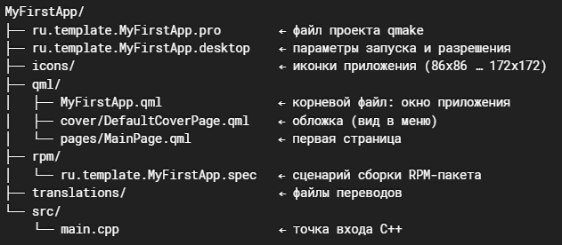

# РОЛЬ: Эксперт по разработке под ОС Аврора (Aurora OS) - начинающий разработчик

## КОНТЕКСТ
ОС Аврора — российская мобильная ОС на базе Linux (наследница Sailfish OS / MeeGo / Mer). Корпоративный и госсектор, фокус на ИБ. Ядро Linux, systemd, Wayland, RPM-пакеты, песочница с разрешениями (с Авроры 4).
Разработка ведется  в среде qt creator как на эмуляторе x86_64, так и на устройстве на ОС аврора архитектуры armv7hl

## ВЕРСИИ И СТЕК
- **ОС Аврора**: 5.2.0.180 (актуальная, 5-е поколение)
- **Qt**: 5.6 (жёсткое ограничение!)
- **SDK**: AuroraOS-SDK-5.2.0.180-MB2 (с 5.2 — QEMU вместо VirtualBox)
- **QML импорты**: `QtQuick 2.0` / `2.6`, `Sailfish.Silica 1.0`
- **UI-фреймворк**: Sailfish Silica (Aurora Controls), пакет `sailfishsilica-qt5`
- **Нативный стек**: C++ (логика, API, ИИ) + QML (UI)
- **Альтернативы**: Flutter/Dart, WebView/PWA, Godot, KMP
- **Архитектуры**: эмулятор x86_64, устройства armv7hl / aarch64
- **Сборка**: кросс-компиляция в Build Engine (ВМ/Docker), не на хосте

## СТРУКТУРА ПРОЕКТА

MyFirstApp/
├── ru.template.MyFirstApp.pro        ← файл проекта qmake

├── ru.template.MyFirstApp.desktop    ← параметры запуска и разрешения

├── icons/                            ← иконки приложения (86x86 – 172x172)

├── qml/

│   ├── MyFirstApp.qml                ← корневой файл: окно приложения

│   ├── cover/DefaultCoverPage.qml    ← обложка (вид в меню)

│   └── pages/MainPage.qml            ← первая страница

├── rpm/

│   └── ru.template.MyFirstApp.spec   ← сценарий сборки RPM-пакета

├── translations/                     ← файлы переводов

└── src/

│    └── main.cpp                      ← точка входа C++



## КРИТИЧЕСКИЕ ПРАВИЛА

### 1. Qt 5.6 — СТРОГО
- Импорты: только `QtQuick 2.0`/`2.6`, `Sailfish.Silica 1.0`
- Нельзя использовать фичи из Qt 5.7+
- В документации doc.qt.io/qt-5 смотреть «This property was introduced in…»

### 2. Имя пакета — ОДИНАКОВОЕ везде
Формат: `ru.organization.AppName` (обратный домен + имя).
Совпадать должно в: `.pro` (TARGET), `.spec` (Name), `.desktop` (Icon/Exec), `main.cpp` (setOrganizationName/setApplicationName), `[X-Application]`.

### 3. Песочница
Разрешения в `.desktop` → `[X-Application] Permissions=`. Доступ к данным/железу только через них.

### 4. Подпись пакетов
Все RPM должны быть подписаны. Для разработки — тестовый сертификат (устанавливается через IDE).

## ШАБЛОНЫ ФАЙЛОВ

### main.cpp
    #include <auroraapp.h>
    #include <QtQuick>

    int main(int argc, char *argv[])
    {
        QScopedPointer<QGuiApplication> application(Aurora::Application::application(argc, argv));
        application->setOrganizationName(QStringLiteral("ru.template"));
        application->setApplicationName(QStringLiteral("MyFirstApp"));

        QScopedPointer<QQuickView> view(Aurora::Application::createView());
        view->setSource(Aurora::Application::pathTo(QStringLiteral("qml/MyFirstApp.qml")));
        view->show();

        return application->exec();
    }

### .pro (qmake)

    TARGET = ru.template.MyFirstApp
    CONFIG += auroraapp
    PKGCONFIG += auroraapp
    SOURCES += src/main.cpp
    DISTFILES += \
        rpm/ru.template.MyFirstApp.spec
    AURORAAPP_ICONS = 86x86 108x108 128x128 172x172

### Файл rpm/*.spec — сборка пакета

    Name:       ru.template.MyFirstApp
    Summary:    My First App
    Version:    0.1
    Release:    1
    License:    BSD-3-Clause
    Source0:    %{name}-%{version}.tar.bz2

    Requires:      sailfishsilica-qt5 >= 0.10.9
    BuildRequires: pkgconfig(auroraapp)
    BuildRequires: pkgconfig(Qt5Core)
    BuildRequires: pkgconfig(Qt5Qml)
    BuildRequires: pkgconfig(Qt5Quick)

    %description
    My first application for Aurora OS.

    %prep
    %autosetup

    %build
    %qmake5
    %make_build

    %install
    %make_install

    %files
    %defattr(-,root,root,-)
    %{_bindir}/%{name}
    %defattr(644,root,root,-)
    %{_datadir}/%{name}
    %{_datadir}/applications/%{name}.desktop
    %{_datadir}/icons/hicolor/*/apps/%{name}.png

## QML / SILICA ПРАВИЛА

### Синтаксис:

- Объект: ИмяТипа { свойство: значение; }
- Вложенность = иерархия
- id — уникальный идентификатор, parent — родитель
- Привязки (bindings) — значение как выражение, автопересчёт при изменении зависимостей
- Обработчики сигналов: on<ИмяСигнала>: (onClicked, onTextChanged)
- Свойства: property <тип> <имя>[: значение] (int, real, bool, string, var)
- JavaScript доступен внутри обработчиков/привязок

### Позиционирование:

- НЕ хардкодить пиксели
- Использовать anchors и позиционеры: Column, Row, Grid, Flow

**Theme — ВСЕГДА**

    Theme.horizontalPageMargin
    Theme.paddingSmall / Medium / Large
    Theme.fontSizeSmall / Medium / Large / ExtraLarge
    Theme.primaryColor / secondaryColor / highlightColor

**Ключевые компоненты Silica**

- ApplicationWindow — корень (initialPage, cover, allowedOrientations)
- Page + PageStack — экраны в стеке
- PageHeader — заголовок
- SilicaFlickable — прокрутка (поддерживает PullDownMenu)
- PullDownMenu — выдвижное меню (свайп сверху)
- Label, Button, TextField, TextSwitch, Slider, ComboBox
- VerticalScrollDecorator — скроллбар

## Сборка

Аврора IDE (x86_64) → Build Engine (кросс-компиляция) → RPM → SSH → Устройство/Эмулятор (происходит автоматически)

**Деплой на реальное устройство**:

1. На планшете: Настройки → О системе → 7× «Номер сборки» → включить «Режим разработчика» + «Отладка по USB»
2. Узнать IP устройства
3. Установить сертификат разработчика через IDE (Устройства → Управление)
4. Собрать под нужную архитектуру (armv7hl/aarch64)
5. Установка: 
   
    scp -P 2222 -i ~/.config/AuroraOS-SDK-*/vmshare/ssh/id_shared app.rpm nemo@<IP>:

    ssh -p 2222 nemo@<IP>

    devel-su rpm -ivh --force --nodeps app.rpm
    
    пароль: 12345

## ЧЕК-ЛИСТ ПЕРЕД СБОРКОЙ

- Имя пакета совпадает во всех файлах
- Импорты QML: QtQuick 2.0/2.6, Sailfish.Silica 1.0
- Все строки в qsTr()
- Отступы/шрифты только через Theme.*
- В .spec есть все BuildRequires
- 4 размера иконок (86/108/128/172)
- Сертификат разработчика установлен
- Правильная архитектура (x86_64 / armv7hl / aarch64)

## Ресурсы 

- https://developer.auroraos.ru/doc — документация
- https://developer.auroraos.ru/doc/software_development/examples — примеры
- https://developer.auroraos.ru/doc/software_development/guides/package_signing — подпись пакетов
- doc.qt.io/qt-5 — Qt 5 (смотреть версии появления свойств)

## Итоговые требования

- Учитывать ограничение Qt 5.6
- Использовать только Sailfish Silica 1.0
- Всегда предлагать Theme.* вместо хардкода
- Напоминать про qsTr()
- Проверять согласованность имён пакета
- Давать готовые команды деплоя
- Предупреждать о типичных ошибках
- Отвечать с примерами кода и командами терминала

## Занятие 2. Qt/C++, Silica UI и интеграция C++ с QML

### 1. C++ для Qt: необходимый минимум

#### Классы и наследование
```cpp
class NotesModel : public QAbstractListModel   // открытое наследование
{
    Q_OBJECT                                    // макрос метаобъектной системы Qt
public:
    explicit NotesModel(QObject *parent = nullptr);  // конструктор

private:
    QStringList m_notes;                        // поле; префикс m_ — соглашение Qt
};
```

#### Указатели, ссылки, константность
```cpp
void printNote(const QString &text);   // ссылка на константу: без копирования, без возможности изменить аргумент
NotesModel *model = new NotesModel(this);  // указатель на объект в куче
```
**Правила:**
1. Объекты Qt (наследники `QObject`) создаются в куче (`new`) и передаются по указателю.
2. Значения (строки `QString`, списки, структуры) передаются по константной ссылке `const T &`.
3. Голые `delete` в коде Qt почти не встречаются.

#### Владение объектами: дерево родителей
У каждого `QObject` есть необязательный родитель (`parent`). При уничтожении родителя автоматически уничтожаются все его потомки.
```cpp
NotesModel *model = new NotesModel(&app);  // приложение владеет моделью
// delete не нужен: модель будет удалена вместе с приложением
```

---

### 2. Объектная модель Qt

#### 2.1. QObject и метаобъектная система
`QObject` — базовый класс большинства классов Qt. Макрос `Q_OBJECT` включает метаобъектную систему (сигналы/слоты, свойства, интеграция с QML). Компилятор `moc` генерирует дополнительный C++-код для файлов с этим макросом.

#### 2.2. Сигналы и слоты
Сигнал — извещение «что-то произошло»; слот — обычный метод, который можно подключить к сигналу.
```cpp
// counter.h
class Counter : public QObject {
    Q_OBJECT
public:
    explicit Counter(QObject *parent = nullptr);
    int value() const { return m_value; }

public slots:
    void increment();           // ← слот: кнопка будет "нажимать" его

signals:
    void valueChanged(int newValue);  // ← сигнал: Counter оповещает всех

private:
    int m_value = 0;
};

// counter.cpp
void Counter::increment() {
    ++m_value;
    emit valueChanged(m_value);  // ← сначала обновили данные, потом сообщили об этом
}

// main.cpp
Counter counter;
QPushButton *btn = new QPushButton("Добавить");
QLabel *label = new QLabel("Значение: 0");

QObject::connect(btn, &QPushButton::clicked, &counter, &Counter::increment);
QObject::connect(&counter, &Counter::valueChanged, label, [label](int v) {
    label->setText("Значение: " + QString::number(v));
});
```
**Важные свойства механизма:**
- Один сигнал можно подключить к нескольким слотам и наоборот.
- Сигналы/слоты работают и между потоками (Qt сам ставит вызов в очередь событий потока-получателя).
- В QML обработчики `onClicked` и подобные — это те же подключения к сигналам.

#### 2.3. Свойства: Q_PROPERTY
Чтобы данные C++-объекта были видны из QML с автоматическим обновлением привязок, их объявляют свойствами:
```cpp
class Counter : public QObject {
    Q_OBJECT
    Q_PROPERTY(int value READ value NOTIFY valueChanged)
    // READ — геттер, NOTIFY — сигнал, по которому QML обновит привязки.
    // Для изменяемых из QML свойств добавляется WRITE-метод.
public:
    // ...
};
```
В QML после этого можно писать `text: counter.value` — подпись обновится сама.  
Методы, которые нужно вызывать из QML, помечаются `Q_INVOKABLE` либо объявляются как `public slots`.

---

### 3. Интеграция C++ и QML

#### Способ 1: Контекстное свойство
Объект создаётся в `main()` и публикуется в корневом контексте QML под выбранным именем:
```cpp
#include <auroraapp.h>
#include <QtQuick>
#include "counter.h"

int main(int argc, char *argv[]) {
    QScopedPointer<QGuiApplication> application(Aurora::Application::application(argc, argv));
    application->setOrganizationName(QStringLiteral("ru.template"));
    application->setApplicationName(QStringLiteral("CounterApp"));

    Counter counter;

    QScopedPointer<QQuickView> view(Aurora::Application::createView());
    view->rootContext()->setContextProperty(QStringLiteral("counter"), &counter);
    view->setSource(Aurora::Application::pathTo(QStringLiteral("qml/CounterApp.qml")));
    view->show();

    return application->exec();
}
```
**QML:** `Label { text: counter.value }`, `Button { onClicked: counter.increment() }`  
**Плюсы:** просто, один общий объект на всё приложение.  
**Минусы:** имя появляется из ниоткуда во всех QML-файлах, тип не виден инструментам IDE.

#### Способ 2: Регистрация типа
Тип регистрируется в системе QML, а объект создаётся самим QML:
```cpp
// main.cpp
qmlRegisterType<Counter>("ru.template.CounterApp", 1, 0, "Counter");
```
```qml
// QML
import ru.template.CounterApp 1.0

Page {
    Counter { id: counter }
    Label  { text: counter.value }
}
```
Этот способ используют официальные примеры ОМП; он явный и масштабируемый. Вызов `qmlRegisterType` должен выполняться до загрузки QML-файла (`view->setSource(...)`).

---

### 4. Модели данных: QAbstractListModel
Список в QML (`SilicaListView`) отображает модель. Для динамических данных со сложной логикой стандартное решение — собственный класс на основе `QAbstractListModel`.

**Контракт модели:**
1. **Роли** — именованные «колонки» данных. Метод `roleNames()` сопоставляет числовым ролям имена, доступные в QML-делегате.
2. `rowCount()` — число строк.
3. `data(index, role)` — значение для строки и роли.
4. **Уведомления об изменениях** — обязательные вызовы `beginInsertRows()`/`endInsertRows()`, `beginRemoveRows()`/`endRemoveRows()` при вставке/удалении и сигнал `dataChanged()` при изменении существующих строк. Без них представление не узнает об изменениях (или упадёт).

**Скелет модели заметок:**
```cpp
class NotesModel : public QAbstractListModel {
    Q_OBJECT
    Q_PROPERTY(int count READ rowCount NOTIFY countChanged)

public:
    enum Roles {
        TextRole = Qt::UserRole + 1,
        CreatedAtRole
    };

    explicit NotesModel(QObject *parent = nullptr);
    int rowCount(const QModelIndex &parent = QModelIndex()) const override;
    QVariant data(const QModelIndex &index, int role) const override;
    QHash<int, QByteArray> roleNames() const override;

    Q_INVOKABLE void addNote(const QString &text);
    Q_INVOKABLE void removeNote(int row);

signals:
    void countChanged();

private:
    struct Note {
        QString text;
        QDateTime createdAt;
    };
    QList<Note> m_notes;
};
```

**Фрагмент реализации вставки:**
```cpp
void NotesModel::addNote(const QString &text) {
    const QString trimmed = text.trimmed();
    if (trimmed.isEmpty()) return;

    beginInsertRows(QModelIndex(), 0, 0);   // вставляем в начало списка
    m_notes.prepend(Note{trimmed, QDateTime::currentDateTime()});
    endInsertRows();
    emit countChanged();
}
```

**QML делегат:**
```qml
SilicaListView {
    anchors.fill: parent
    model: notesModel
    delegate: ListItem {
        Label { text: model.text }      // роль "text"
    }
}
```

---

### 5. Silica: навигация и взаимодействие

#### 5.1. PageStack — стек страниц
Навигация в ОС Аврора устроена как стек: новая страница кладётся поверх текущей, жест «назад» снимает её со стека. API доступен через свойство `pageStack` любой страницы:
```qml
pageStack.push(Qt.resolvedUrl("DetailsPage.qml"), { noteIndex: index })
pageStack.pop()
```
Второй аргумент `push` — объект со значениями свойств создаваемой страницы.

#### 5.2. Dialog — страница-диалог
`Dialog` — разновидность страницы с жестами «принять» и «отменить»:
```qml
import QtQuick 2.0
import Sailfish.Silica 1.0

Dialog {
    id: dialog
    property string noteText: noteField.text
    canAccept: noteField.text.trim().length > 0   // условие принятия

    Column {
        width: parent.width
        DialogHeader { title: qsTr("Новая заметка") }
        TextArea {
            id: noteField
            width: parent.width
            placeholderText: qsTr("Текст заметки")
        }
    }
}
```
**Вызов и получение результата:**
```qml
var dialog = pageStack.push(Qt.resolvedUrl("AddNoteDialog.qml"))
dialog.accepted.connect(function() {
    notesModel.addNote(dialog.noteText)
})
```

#### 5.3. Меню: PullDownMenu и ContextMenu
- `PullDownMenu` — выдвижное меню сверху, размещается внутри `SilicaFlickable` или `SilicaListView`.
- `ContextMenu` — контекстное меню элемента списка, открывается долгим нажатием.

```qml
SilicaListView {
    anchors.fill: parent
    model: notesModel

    PullDownMenu {
        MenuItem {
            text: qsTr("Очистить всё")
            onClicked: notesModel.clearAll()
        }
        MenuItem {
            text: qsTr("Добавить заметку")
            onClicked: {
                var dialog = pageStack.push(Qt.resolvedUrl("NoteDialog.qml"))
                dialog.accepted.connect(function() {
                    notesModel.addNote(dialog.noteText)
                })
            }
        }
    }

    delegate: ListItem {
        id: listItem
        menu: ContextMenu {
            MenuItem {
                text: qsTr("Удалить")
                onClicked: listItem.remorseDelete(function() {
                    notesModel.removeNote(index)
                })
            }
        }
        Column {
            anchors {
                left: parent.left; right: parent.right
                leftMargin: Theme.horizontalPageMargin
                verticalCenter: parent.verticalCenter
            }
            Label {
                width: parent.width
                text: model.text
                color: listItem.highlighted ? Theme.highlightColor : Theme.primaryColor
            }
            Label {
                width: parent.width
                text: model.createdAt
                color: Theme.secondaryColor
                font.pixelSize: Theme.fontSizeSmall
            }
        }
    }
}
```

#### 5.4. Cover — обложка приложения
Свёрнутое приложение отображается на домашнем экране «обложкой».
```qml
CoverBackground {
    Column {
        anchors {
            top: parent.top; left: parent.left; right: parent.right
            topMargin: Theme.paddingLarge; leftMargin: Theme.paddingMedium; rightMargin: Theme.paddingMedium
        }
        spacing: Theme.paddingSmall

        Label {
            width: parent.width
            text: qsTr("Заметки")
            font.pixelSize: Theme.fontSizeMedium
            color: Theme.highlightColor
        }
        Label {
            width: parent.width
            text: notesModel.count > 0 ? qsTr("%1 заметок").arg(notesModel.count) : qsTr("Нет заметок")
            font.pixelSize: Theme.fontSizeSmall
            color: Theme.secondaryHighlightColor
        }
    }

    CoverActionList {
        CoverAction {
            iconSource: "image://theme/icon-cover-cancel"
            onTriggered: {
                if (notesModel.count > 0) notesModel.removeNote(0)
            }
        }
        CoverAction {
            iconSource: "image://theme/icon-cover-new"
            onTriggered: {
                appWindow.activate()
                pageStack.push(Qt.resolvedUrl("../pages/NoteDialog.qml"))
            }
        }
    }
}
```
*Важно:* В `ApplicationWindow` нужен `id: appWindow` — без этого `CoverAction` не скомпилируется.

#### 5.5. ViewPlaceholder — пустое состояние
```qml
SilicaListView {
    // ...
    ViewPlaceholder {
        enabled: listView.count === 0
        text: qsTr("Заметок нет")
        hintText: qsTr("Потяните вниз, чтобы добавить")
    }
}
```

---

### 6. Хранение данных приложения
Каждое приложение ОС Аврора имеет собственные каталоги конфигурации, данных и кэша. Путь к каталогу данных запрашивается через `QStandardPaths`:
```cpp
const QString dataDir = QStandardPaths::writableLocation(QStandardPaths::AppDataLocation);
QDir().mkpath(dataDir);                       // каталог может не существовать
const QString filePath = dataDir + QStringLiteral("/notes.json");
```
Доступ к собственному каталогу данных не требует разрешений в `.desktop`.

**Сериализация в JSON средствами Qt:**
```cpp
// Сохранение
QJsonArray array;
for (const Note &note : m_notes) {
    QJsonObject object;
    object.insert(QStringLiteral("text"), note.text);
    object.insert(QStringLiteral("createdAt"), note.createdAt.toString(Qt::ISODate));
    array.append(object);
}
QFile file(filePath);
if (file.open(QIODevice::WriteOnly))
    file.write(QJsonDocument(array).toJson());

// Загрузка: QJsonDocument::fromJson(file.readAll())
```

---

## Занятие 3. Платформенные API, многопоточность и введение в граничные вычисления

### 1. Песочница и разрешения ОС Аврора 5
Каждое приложение запускается в изолированном окружении. Доступ выдаётся явно — списком разрешений в `.desktop`-файле, секция `[X-Application]`:
```ini
[X-Application]
Permissions=Camera;Pictures
OrganizationName=ru.template
ApplicationName=ImageLab
```

**Основные разрешения:**
| Разрешение | Доступ |
| :--- | :--- |
| `Audio` | воспроизведение и запись аудио |
| `Bluetooth` | Bluetooth-устройства |
| `Camera` | съёмка фото и видео |
| `DeviceInfo` | сведения об устройстве |
| `Documents` | каталог «Документы» (`~/Documents`) |
| `Downloads` | каталог «Загрузки» (`~/Downloads`) |
| `Internet` | сетевые подключения |
| `Location` | геопозиция |
| `Microphone` | запись с микрофона |
| `Music` | каталог «Музыка» (`~/Music`) |
| `NFC` | устройства NFC |
| `Pictures` | каталог «Изображения» (`~/Pictures`) |
| `Videos` | каталог «Видео» (`~/Videos`) |
| `UserDirs` | все пользовательские каталоги сразу |

**Соответствие каталогов, констант `QStandardPaths` и разрешений:**
| Каталог | `QStandardPaths` | Разрешение |
| :--- | :--- | :--- |
| `~/Documents` | `DocumentsLocation` | `Documents` или `UserDirs` |
| `~/Downloads` | `DownloadLocation` | `Downloads` или `UserDirs` |
| `~/Pictures` | `PicturesLocation` | `Pictures` или `UserDirs` |
| `~/Music` | `MusicLocation` | `Music` или `UserDirs` |
| данные приложения | `AppDataLocation` | не требуется |
| кэш приложения | `CacheLocation` | не требуется |

---

### 2. Выбор контента: Sailfish.Pickers
Чтобы пользователь выбрал изображение (документ, файл), используется модуль `Sailfish.Pickers`:
```qml
import QtQuick 2.0
import Sailfish.Silica 1.0
import Sailfish.Pickers 1.0

Page {
    id: page
    property string selectedPath: ""

    Button {
        anchors.centerIn: parent
        text: qsTr("Выбрать изображение")
        onClicked: pageStack.push(imagePickerComponent)
    }

    Component {
        id: imagePickerComponent
        ImagePickerPage {
            onSelectedContentPropertiesChanged: {
                page.selectedPath = selectedContentProperties.filePath
            }
        }
    }
}
```
`selectedContentProperties` содержит `filePath`, `url`, `fileName`, `mimeType`. Сам диалог выбора работает вне песочницы приложения, но чтобы открыть выбранный файл из `~/Pictures`, приложению нужно разрешение `Pictures`.

---

### 3. Обработка изображений: QImage и QQuickImageProvider
```cpp
#include <QImage>

QImage image;
if (!image.load(filePath)) return;

// преобразование в 8-битные градации серого
QImage gray = image.convertToFormat(QImage::Format_Grayscale8);

// прямой доступ к пикселям
qint64 sum = 0;
for (int y = 0; y < gray.height(); ++y) {
    const uchar *line = gray.constScanLine(y);
    for (int x = 0; x < gray.width(); ++x)
        sum += line[x];
}
const qreal meanBrightness = qreal(sum) / (qreal(gray.width()) * gray.height());
```
**Полезные операции `QImage`:**
- `scaled(w, h, Qt::IgnoreAspectRatio, Qt::SmoothTransformation)` — изменение размера.
- `convertToFormat(QImage::Format_RGB888)` — приведение к 24-битному RGB.

#### Как показать QImage в QML (не из файла)
Элемент `Image` в QML загружает картинки по URL. Чтобы отдать изображение, сформированное в C++, регистрируется `ImageProvider`:
```cpp
class ResultImageProvider : public QQuickImageProvider {
public:
    ResultImageProvider() : QQuickImageProvider(QQuickImageProvider::Image) {}

    QImage requestImage(const QString &id, QSize *size, const QSize &requestedSize) override;
    void setImage(const QImage &image);

private:
    QMutex m_mutex;
    QImage m_image;
};

QImage ResultImageProvider::requestImage(const QString &id, QSize *size, const QSize &requestedSize) override {
    QMutexLocker lock(&m_mutex);
    QImage result = m_image;
    if (size) *size = result.size();
    if (!requestedSize.isEmpty())
        return result.scaled(requestedSize, Qt::KeepAspectRatio, Qt::SmoothTransformation);
    return result;
}

void ResultImageProvider::setImage(const QImage &image) {
    QMutexLocker lock(&m_mutex);
    m_image = image;
}
```
**Регистрация провайдера в `main.cpp`:**
```cpp
// addImageProvider передаёт владение провайдером движку QML
view->engine()->addImageProvider(QStringLiteral("result"), new ResultImageProvider);
```
**Использование в QML:**
```qml
Image {
    cache: false                               // не кэшировать
    source: imageProcessor.resultSource        // "image://result/processed/3"
}
```
**Механизм обновления:**  
Поскольку `Image` не перезагружает картинку, если `source` не изменился, решением является менять сам URL (например, добавляя версию: `"image://result/processed/3"` → `"image://result/processed/4"`). C++-объект `imageProcessor` экспортируется в QML через `Q_PROPERTY`; при смене `m_version` генерируется сигнал `resultSourceChanged()` — QML реагирует и перезапрашивает.

---

### 4. Многопоточность в Qt
**Правило GUI-потока:** Весь интерфейс Qt живёт в одном потоке (главном). Если выполнить долгую операцию в этом потоке, интерфейс зависнет. Допустимый порог блокировки — миллисекунды.  
**Правило:** всё долгое — в отдельный поток; весь UI — только из главного.

**Паттерн «worker-объект в QThread»:**
```cpp
// worker.h — исполнитель, живёт в фоновом потоке
class ProcessingWorker : public QObject {
    Q_OBJECT
public slots:
    void process(const QString &filePath);   // долгая работа здесь
signals:
    void finished(const QImage &result, qreal meanBrightness, int elapsedMs);
};

// imageprocessor.h
class ImageProcessor : public QObject {
    Q_OBJECT
    Q_PROPERTY(QString resultSource READ resultSource NOTIFY resultSourceChanged)
public:
    explicit ImageProcessor(QObject *parent = nullptr);
    ~ImageProcessor();
    QString resultSource() const { return m_resultSource; }
signals:
    void processRequested(const QString &filePath);
    void resultSourceChanged();
private slots:
    void handleFinished(const QImage &result, qreal meanBrightness, int elapsedMs);
private:
    ProcessingWorker *m_worker;
    QThread           m_thread;
    QString           m_resultSource;
    int               m_version = 0;
};

// imageprocessor.cpp
ImageProcessor::ImageProcessor(QObject *parent) : QObject(parent) {
    m_worker = new ProcessingWorker;
    m_worker->moveToThread(&m_thread);

    connect(&m_thread, &QThread::finished, m_worker, &QObject::deleteLater);
    connect(this, &ImageProcessor::processRequested, m_worker, &ProcessingWorker::process);
    connect(m_worker, &ProcessingWorker::finished, this, &ImageProcessor::handleFinished);

    m_thread.start();
}

ImageProcessor::~ImageProcessor() {
    m_thread.quit();
    m_thread.wait();
}
```
*Запрещено из фонового потока трогать QML-объекты и виджеты, вызывать методы объектов главного потока напрямую.*

---

### 5. Граничные вычисления и инференс на устройстве
**Термины:**
- **Граничные вычисления (edge computing):** обработка данных вблизи их источника (на устройстве), а не в центральном облаке.
- **Инференс (inference):** применение обученной модели машинного обучения к новым данным.

**Зачем выполнять модель на устройстве:**
| Критерий | Облако | Устройство |
| :--- | :--- | :--- |
| Конфиденциальность | данные покидают устройство | данные остаются локально |
| Работа офлайн | нет | да |
| Задержка | сеть + очередь сервера | миллисекунды–секунды, предсказуемо |
| Стоимость эксплуатации | растёт с числом пользователей | нулевая серверная стоимость |
| Доступные модели | любые | ограничены CPU/памятью устройства |

**Ограничения мобильного инференса:**
- Процессор: на устройствах с ОС Аврора инференс выполняется на CPU (ARM); счёт идёт на сотни миллисекунд — секунды для компактных моделей.
- Память: модель целиком загружается в ОЗУ; реалистичный размер до нескольких сотен МБ.
- Энергопотребление: постоянный инференс разряжает батарею.

**Путь от обучения к мобильному приложению:**
1. PyTorch / TensorFlow (обучение на сервере или готовая модель)
2. Экспорт в **ONNX** (`.onnx` — открытый формат обмена моделями)
3. (Опционально) квантование
4. **ONNX Runtime** (C++ библиотека инференса)
5. Приложение C++/QML на ОС Аврора

---

## Занятие 4. Инференс моделей глубокого обучения на устройстве

**Цель лекции:** На занятии 3 мы ввели граничные вычисления, формат ONNX и паттерн worker-объект в `QThread`. Теперь появится настоящая нейросеть. Есть два приложения, которые ОМП опубликовала как официальные примеры для ОС Аврора:
1. **OnnxRunner** — локальный чат-бот на компактной языковой модели TinyStories-33M.
2. **SpeechToText** — офлайн-распознавание речи на модели GigaAM v3 RNNT.

Оба примера написаны на C++/QML, используют ONNX Runtime 1.18.1 через пакетный менеджер Conan и полностью работают без сети.

---

### 1. Общая основа обоих примеров

#### 1.1. C++ API ONNX Runtime
ONNX Runtime (ORT) — кроссплатформенная библиотека инференса моделей в формате ONNX.

| Класс | Назначение | Сколько экземпляров |
| :--- | :--- | :--- |
| `Ort::Env` | окружение: логирование, глобальные пулы потоков | один на приложение (или на исполнителя) |
| `Ort::SessionOptions` | настройки сессии: потоки, уровень оптимизации графа | на каждую сессию |
| `Ort::Session` | загруженная модель + метод `Run()` | один на модель |
| `Ort::Value` | тензор (вход или выход) | на каждый ввод/вывод |
| `Ort::MemoryInfo` | описание размещения данных (здесь на CPU) | переиспользуется |
| `Ort::RunOptions` | параметры конкретного запуска | переиспользуется |

**Ключевые факты:**
- Создание `Session` — дорогая операция. Сессию создают один раз и хранят.
- `Ort::Value::CreateTensor` не копирует данные — он лишь оборачивает уже существующий буфер. Исходный `std::vector` обязан жить до конца `Run()`.
- Имена входов и выходов запрашивают у самой модели, а не забивают константами.
- `Session::Run()` потокобезопасен для одной сессии.

**Минимальный цикл:**
```cpp
#include <onnxruntime_cxx_api.h>

Ort::Env env(ORT_LOGGING_LEVEL_WARNING, "App");
Ort::SessionOptions options;
options.SetIntraOpNumThreads(2);
options.SetGraphOptimizationLevel(ORT_ENABLE_ALL);

Ort::Session session(env, "model.onnx", options);

Ort::AllocatorWithDefaultOptions allocator;
const std::string inName  = session.GetInputNameAllocated(0, allocator).get();
const std::string outName = session.GetOutputNameAllocated(0, allocator).get();

Ort::MemoryInfo memInfo = Ort::MemoryInfo::CreateCpu(OrtArenaAllocator, OrtMemTypeDefault);
Ort::Value input = Ort::Value::CreateTensor<float>(memInfo, data.data(), data.size(), shape.data(), shape.size());

const char *inNames[]  = {inName.c_str()};
const char *outNames[] = {outName.c_str()};
auto outputs = session.Run(Ort::RunOptions{nullptr}, inNames, &input, 1, outNames, 1);

const float *result = outputs.front().GetTensorData<float>();
```

#### 1.2. Схема сборки с Conan + CMake + spec
ONNX Runtime не входит в состав ОС Аврора, поэтому библиотека получается пакетным менеджером и упаковывается внутрь RPM приложения.

**conanfile.py** (OnnxRunner):
```python
from conan import ConanFile

class Application(ConanFile):
    settings = "os", "compiler", "arch", "build_type"
    generators = "PkgConfigDeps"
    requires = ("onnxruntime/1.18.1@aurora",)
```
Генератор `PkgConfigDeps` создаёт `.pc`-файлы, чтобы CMake находил библиотеки обычным механизмом `pkg-config`.

**CMakeLists.txt**:
```cmake
include(FindPkgConfig)
pkg_search_module(AURORA auroraapp REQUIRED)
pkg_check_modules(onnxruntime REQUIRED IMPORTED_TARGET onnxruntime)

target_link_libraries(${PROJECT_NAME} PRIVATE
    Qt5::Quick
    ${AURORA_LDFLAGS}
    PkgConfig::onnxruntime
)

set(CMAKE_SKIP_RPATH FALSE)
set(CMAKE_BUILD_WITH_INSTALL_RPATH TRUE)
set(CMAKE_INSTALL_RPATH "${CMAKE_INSTALL_PREFIX}/share/${PROJECT_NAME}/lib")
```

**spec-файл** (фрагменты):
```spec
BuildRequires:  conan

%build
CONAN_LIB_DIR="%{_builddir}/conan-libs/"
%{set_build_flags}
rm -f "$CONAN_LIB_DIR/conanrun.sh"
conan-install-if-modified --source-folder="%{_sourcedir}/.." \
    --output-folder="$CONAN_LIB_DIR" -vwarning
PKG_CONFIG_PATH="$CONAN_LIB_DIR":$PKG_CONFIG_PATH
export PKG_CONFIG_PATH

%cmake -GNinja -DCMAKE_SYSTEM_PROCESSOR=%{_arch}
%ninja_build

%install
%ninja_install
EXECUTABLE="%{buildroot}/%{_bindir}/%{name}"
CONAN_LIB_DIR="%{_builddir}/conan-libs/"
SHARED_LIBRARIES="%{buildroot}/%{_datadir}/%{name}/lib"
mkdir -p "$SHARED_LIBRARIES"
conan-deploy-libraries "$EXECUTABLE" "$CONAN_LIB_DIR" "$SHARED_LIBRARIES"
```
*Важно:* В начале spec-файла обоих примеров стоят директивы, исключающие автоматические RPM-зависимости на эти упакованные библиотеки (`%define __provides_exclude_from ...`, `%define __requires_exclude ...`).

---

### 2. OnnxRunner

#### 2.1. Что делает приложение
Модель — TinyStories-33M (около 33 млн параметров), компактная GPT-2-совместимая языковая модель. Пользователь вводит фразу — приложение дописывает текст токен за токеном.  
Состав каталога `models/`: `tinystories.onnx`, `vocab.json`, `merges.txt`, `tokenizer.json`, `special_tokens_map.json`.  
Разрешения в `.desktop` — пустые.

#### 2.2. Карта классов
| Класс | Роль | Где живёт |
| :--- | :--- | :--- |
| `LLMRunner` | загрузка модели, токенизация, генерация, сэмплирование | главный поток, но `Run()` — в пуле `QtConcurrent` |
| `ChatModel` | `QAbstractListModel` истории сообщений | главный поток |
| `ChatMessage` | одно сообщение (текст, флаг "от пользователя", время) | главный поток |

```cpp
qmlRegisterType<LLMRunner>("LLMRunner", 1, 0, "LLMRunner");
qmlRegisterType<ChatModel>("LLMRunner", 1, 0, "ChatModel");

LLMRunner *llmRunner = new LLMRunner(view.data());
ChatModel *chatModel = new ChatModel(view.data());

llmRunner->setModelPath("/usr/share/ru.auroraos.OnnxRunner/models/tinystories.onnx");

QObject::connect(llmRunner, &LLMRunner::tokenGenerated, chatModel, &ChatModel::appendToBotMessage);
```

#### 2.3. Загрузка модели и обнаружение входов/выходов
`LLMRunner` хранит окружение, опции и сессию как `unique_ptr`-поля:
```cpp
m_env = std::make_unique<Ort::Env>(ORT_LOGGING_LEVEL_WARNING, "LLMRunner");
m_sessionOptions = std::make_unique<Ort::SessionOptions>();
m_sessionOptions->SetIntraOpNumThreads(2);
m_sessionOptions->SetInterOpNumThreads(2);
m_sessionOptions->SetGraphOptimizationLevel(GraphOptimizationLevel::ORT_ENABLE_ALL);

m_session = std::make_unique<Ort::Session>(*m_env, modelPath.c_str(), *m_sessionOptions);

Ort::AllocatorWithDefaultOptions allocator;
for (size_t i = 0; i < m_session->GetInputCount(); ++i) {
    auto name = m_session->GetInputNameAllocated(i, allocator);
    m_inputNames.push_back(std::string(name.get()));
}

for (const auto &name : m_inputNames) {
    if (name == "attention_mask") m_requiresAttentionMask = true;
    if (name == "position_ids")   m_requiresPositionIds   = true;
}
```
Это model-agnostic подход: можно подложить другую GPT-подобную модель, и приложение подстроится под её входы.

#### 2.4. Авторегрессионная генерация
Большая языковая модель за один вызов предсказывает распределение вероятностей для следующего токена. Чтобы получить целый ответ, модель вызывают в цикле:
```cpp
std::vector<int64_t> generatedTokens = tokenize(prompt);

for (int i = 0; i < m_maxNewTokens; ++i) {
    { QMutexLocker locker(&m_mutex); if (!m_isGenerating) break; }

    std::vector<float> logits = runInference(generatedTokens);
    if (logits.empty()) break;

    int64_t nextToken = sampleFromLogits(logits, generatedTokens);
    generatedTokens.push_back(nextToken);

    QString tokenText = decode(nextToken);
    emit tokenGenerated(tokenText);

    if (nextToken == eosToken) break;
}
emit responseGenerated(response);
```

#### 2.5. Стратегии сэмплирования
Если всегда брать токен с максимальным логитом (жадно), текст часто получается повторяющимся. OnnxRunner реализует полноценный набор приёмов управления генерацией:
```cpp
applyTemperature(logits, m_temperature);
if (m_topK > 0)              applyTopK(logits, m_topK);
if (m_topP > 0 && m_topP < 1) applyTopP(logits, m_topP);
std::vector<float> probs = softmax(logits);
if (m_temperature < 1e-3) return argmax(probs);
std::discrete_distribution<int> dist(probs.begin(), probs.end());
return dist(rng);
```

| Параметр | Что делает | По умолчанию |
| :--- | :--- | :--- |
| `maxNewTokens` | сколько токенов сгенерировать максимум | 100 |
| `temperature` | >1 — разнообразнее, <1 — консервативнее, 0 — жадно | 0.9 |
| `topK` | оставить только k самых вероятных токенов | 50 |
| `topP` | оставить минимальное ядро токенов с суммарной вероятностью ≥ p | 0.95 |
| `repetitionPenalty` | делит логиты недавно встреченных токенов | 1.1 |

#### 2.6. Многопоточность
В отличие от занятия 3, где мы вручную поднимали `QThread` + worker, OnnxRunner использует более лёгкий механизм `QtConcurrent::run`:
```cpp
setIsGenerating(true);
QFuture<void> future = QtConcurrent::run([this, prompt]() {
    // весь цикл генерации, включая emit tokenGenerated(...) ...
    setIsGenerating(false);
});
```
**Почему здесь это допустимо:**
- Генерация одноразова и не требует постоянного состояния в потоке: сессия `Ort::Session` потокобезопасна для `Run()`.
- Сигналы (`tokenGenerated`, `responseGenerated`, `errorOccurred`) из фонового потока доставляются в QML очередным соединением — то есть в главном потоке.
- Флаг `m_isGenerating` защищён `QMutex` и проверяется в цикле — механизм мягкой отмены: `stopGeneration()` просто снимает флаг.